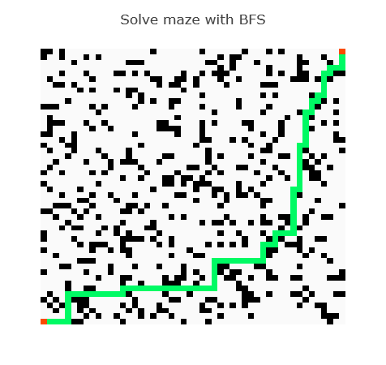

# Classic Computer Science Problems in Julia
This is the driver repository for [`Classic.jl`](https://github.com/ykyang/Classic.jl) which follows the book [Classic Computer Science Problems in Java](https://livebook.manning.com/book/classic-computer-science-problems-in-java) and translated into Julia.

## Breadth-first search
`bfs_heatmap(maze)` plots a maze solved by BFS.

A more dense maze.

